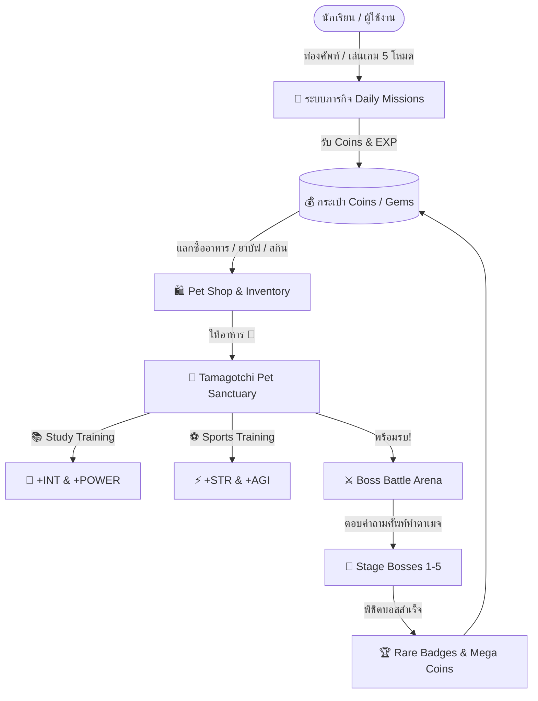

# Word Buddy — Gamification, Tamagotchi Pet & Boss Battle System Spec

**Date:** 2026-08-18  
**Design Style:** Modern 2D Cartoon, vibrant colors, playful, smooth CSS micro-animations.

---

## 1. System Architecture Overview

---

## 2. Core Modules Specification

### 🎯 Module A: Mission & Reward Engine
* **Daily Quests (รีเซ็ตทุกวัน)**:
  1. *Quick Review*: เล่น Flashcards อย่างน้อย 10 คำ (+50 Coins)
  2. *Spelling Master*: ผ่านเกม Spelling Quiz 1 รอบ (+75 Coins)
  3. *Sharp Shooter*: ตอบถูกใน Multiple Choice หรือ Matching 5 ข้อติด (+100 Coins)
  4. *Pet Lover*: ให้อาหารสัตว์เลี้ยง 1 ครั้ง (+30 Coins)
* **Streak Bonus**: รักษาสตรีคสะสมรับโบนัสสัปดาห์

---

### 🐾 Module B: Modern 2D Cartoon Pet Sanctuary (`/pet`)
* **สัตว์เลี้ยงเริ่มต้น 4 ชนิด (Modern 2D Vectors)**:
  1. 🦉 **Buddy Owl (สายปัญญา - High INT & POWER)**
  2. 🐲 **Pyro Drake (สายพลัง - High STR & POWER)**
  3. ⚡ **Volt Cat (สายความเร็ว - High AGI & STR)**
  4. 🌿 **Flora Slime (สายสมดุล - Balanced All-Rounder)**
* **สถานะและการดูแล (Status Bars)**:
  * 🍖 **Hunger (0-100%)**: ลดลงเรื่อยๆ เมื่อเวลาผ่านไป เพิ่มได้จากการให้อาหาร
  * 💖 **Happiness (0-100%)**: เพิ่มขึ้นจากการฝึกซ้อมและการลูบคลำ
  * ⭐ **Level & EXP Bar**: เลเวลเพิ่มเมื่อนำไปฝึกหรือชนะบอส
* **ค่าพลัง 4 ด้าน (Combat Stats)**:
  * **STR (Strength)**: เพิ่มพลังโจมตีกายภาพ
  * **AGI (Agility)**: เพิ่มความเร็วเทิร์นและโอกาสติด Critical
  * **INT (Intelligence)**: เพิ่มความแม่นยำและป้องกัน
  * **POWER (Ultimate Burst)**: เพิ่มความแรงท่าไม้ตาย Special Move
* **3 กิจกรรมหลักใน Sanctuary**:
  * 🍖 **Feed**: เลือกไอเทมอาหารจาก Inventory ให้สัตว์เลี้ยงกิน
  * 📚 **Study Training (INT/POWER)**: มินิเกมตอบศัพท์เร็ว 5 ข้อเพื่อบูสต์สเตตัส
  * ⚽ **Sports Training (STR/AGI)**: มินิมินิเกมออกกำลังกายจับคู่คำศัพท์

---

### 🛍️ Module C: Pet Shop & Inventory (`/shop`)
* **หมวดหมู่อาหาร (Food)**:
  * 🍎 Fresh Apple (15 Coins) $\rightarrow$ +20 Hunger, +5 Happiness
  * 🐟 Golden Fish (30 Coins) $\rightarrow$ +40 Hunger, +15 Happiness
  * 🥩 Prime Steak (60 Coins) $\rightarrow$ +80 Hunger, +30 Happiness
  * 🫐 Cosmic Berry (100 Coins) $\rightarrow$ +100 Hunger, +50 Happiness, +50 EXP
* **หมวดหมู่น้ำยาบัฟ (Potions)**:
  * 🧪 EXP Potion (150 Coins) $\rightarrow$ +200 Pet EXP ทันที
  * ⚡ Energy Elixir (120 Coins) $\rightarrow$ ฟื้นฟูค่าพลังทันที

---

### ⚔️ Module D: Adventure Boss Battle Arena (`/battle`)
* **ระบบ 5 ด่านผจญภัย (5 Boss Stages)**:
  * 🌲 **Stage 1: Goblin Grunt** (HP: 300) — ด่านป่าเริ่มต้น
  * ❄️ **Stage 2: Frost Yeti** (HP: 600) — ด่านภูเขาหิมะ
  * 🌋 **Stage 3: Magma Golem** (HP: 1,000) — ด่านภูเขาไฟ
  * 🏰 **Stage 4: Shadow Wyrm** (HP: 1,500) — ด่านปราสาทเงา
  * 👑 **Stage 5: Ancient Void Mage** (HP: 2,500) — ด่านบอสใหญ่แห่งโลกคำศัพท์
* **กลไกการต่อสู้ (Quiz Combat Mechanics)**:
  * **ระบบสลับเทิร์น**: ผู้เล่นได้รับคำถามคำศัพท์ 1 ข้อ (4 ตัวเลือก / เติมคำ)
  * **คำนวณดาเมจ**:
    $$\text{Damage} = \text{Base Atk} + \text{Pet STR} \times \text{Speed Multiplier (AGI)} + \text{Combo Bonus}$$
  * **Critical Strike**: เมื่อตอบถูกภายใน 2 วินาทีแรก
  * **Power Burst**: เมื่อตอบถูกสะสมครบ 3 ข้อ จะสามารถกดใช้ **ท่าไม้ตายสุดอลังการ (Ultimate Burst)** ของสัตว์เลี้ยงได้!

---

## 3. UI/UX Component Plan
1. `src/components/gamification/DailyMissionsModal.tsx` — หน้าต่างเควสประจำวัน
2. `src/components/gamification/CoinCounter.tsx` — วิดเจ็ตเหรียญทองในแถบ Navigation
3. `src/pages/pet/PetSanctuaryPage.tsx` — หน้าสัตว์เลี้ยงทามาก็อตจิ Modern 2D
4. `src/pages/pet/PetShopPage.tsx` — หน้าต่างร้านค้าแลกซื้ออาหารและยา
5. `src/pages/battle/BossBattlePage.tsx` — หน้าสนามประลองสู้บอสประจำด่าน
6. `src/services/gamificationService.ts` — ตัวจัดการ Local State & Supabase Sync
